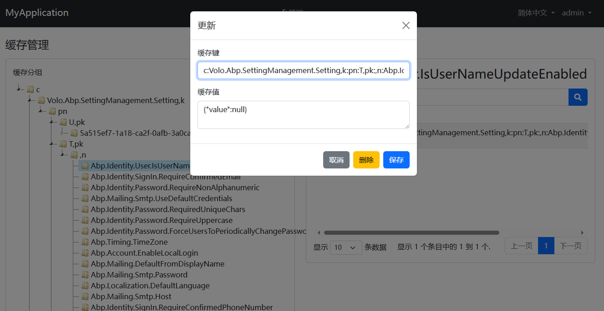

# CacheManagement

## Getting Started

### 1.Install the following NuGet packages.
  * JS.Abp.CacheManagement.Application
  * JS.Abp.CacheManagement.Application.Contracts
  * JS.Abp.CacheManagement.HttpApi
  * JS.Abp.CacheManagement.HttpApi.Client

  *(Optional)  JS.Abp.CacheManagement.Blazor
  *(Optional)  JS.Abp.CacheManagement.Blazor.Server
  *(Optional)  JS.Abp.CacheManagement.Blazor.WebAssembly
  
### 2.Add `DependsOn` attribute to configure the module
 * [DependsOn(typeof(CacheManagementApplicationModule))]
 * [DependsOn(typeof(CacheManagementApplicationContractsModule))]
 * [DependsOn(typeof(CacheManagementHttpApiModule))]
 * [DependsOn(typeof(CacheManagementHttpApiClientModule))]

 *(Optional)  [DependsOn(typeof(CacheManagementBlazorModule))]
 *(Optional)  [DependsOn(typeof(CacheManagementBlazorServerModule))]
 *(Optional)  [DependsOn(typeof(CacheManagementBlazorWebAssemblyModule))]

## Samples

See the [sample projects Blazor](https://github.com/zhaofenglee/CacheManagement/tree/master/host/JS.Abp.CacheManagement.Blazor.Host)
See the [sample projects Mvc](https://github.com/zhaofenglee/CacheManagement/tree/master/host/JS.Abp.CacheManagement.Web.Unified)
